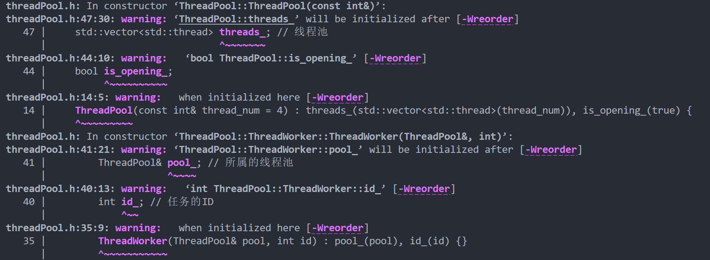

# 线程池笔记

## C++语法部分
### 对象的成员属性的初始化顺序

<font color="red">C++中对象的初始化其实是有严格顺序的，是按照对象在类中的声明顺序进行构造</font>，这跟C++对象模型有关。
在编译时，若是``g++``开启了``-Wall``选项，并且代码中出现了构造函数的**初始化列表**的初始化顺序和成员声明顺序不一致时，就会出现此警告，因为成员变量之间很可能存在依赖关系，这可能导致潜藏的错误：

```cpp
class Temp {
public:
    // 会出现警告
    // 初始化列表中赋值顺序和成员属性声明顺序不一致
    // 但是实际上 按照声明顺序进行赋值 
    Temp(int val, string name) : val(val), name(name) {}
private:
    string name;
    int val;
};
```

### 可变参数模板（模板元编程）
```cpp
template <class F, class... Args>
```
- ``...``是可变参数模板的关键，表示这是一个**参数包**
- ``Args``是参数包的名称，其中可以包含任意数量和类型的模板参数

可变参数模板有几种使用方式：
1. 递归展开参数包
    ```cpp
    template <class T>
    T add(T first) { return first; }

    template <class T, class... Args>
    T add(T first, Args... args) {
        return first + add(args...);
    }
    ```
    注意这个只有一个参数的``add(T)``就是递归的终止条件，当参数包中只有一个参数的时候，将会使用此版本。
2. 使用折叠表达式：
    ```cpp
    template <class... Args>
    auto add(Args... args) {
        return (args + ...);
    }
    ```
    这个就不得不提到C++17的折叠表达式了：

    - 一元右折叠表达式的语法是 (pack op ...)，其中``pack``是参数包，``op``是一个二元运算符。它的展开规则是从右到左依次应用运算符。例如，对于 ``(args + ...)``，如果参数包``args``包含 a, b, c，则展开后的表达式为 ``(a + (b + c))``
    - 一元左表达式就是换个位置，换之后，展开规则也随之相反
    - 二元左/右折叠表达式（略）

### std::bind和std::function
当一个函数的传参和使用``std::bind``绑定的参数完全匹配的时候，我们就可以像使用一个无参函数那样去使用它：
```cpp
#include <iostream>
#include <functional>
using namespace std;

int add(int a, int b) {
    return a + b;
}

int main() {
    function<int()> f = std::bind(add, 1, 2);
    cout << f();
}
```
当然，也可以只匹配部分参数，未匹配的参数就需要使用**占位符**进行占位了，同时得到的``f``的类型也会对应发生改变：
```cpp
function<int(int)> f = std::bind(add, 1, placeholders::_1);
```

放在模板中，它就能搭配可变参数模板进行使用，从而使得有参函数能够转换为``无参函数``：
```cpp
template <class F, class... Args>
auto wrapper(F func, Args... args) {
    auto f = std::bind(func, args...);
    return f(); // 将func包装成了一个无参函数
}
```
其中的``f``就是一个无参函数了。

### decltype
<font color="red">它会在编译期确定表达式的类型</font>，大多数的表达式使用它都能够进行类型推导，这里给出一个例子：
```cpp
int main() {
    int num = 10;
    decltype(num) val = 3.14;
    cout << val << endl;
}
```
这段代码输出的结果会是``3``，其实这段代码在编写出来之后编译器已经会提醒了：

### futrue
[C++并发编程#future](https://paul.pub/cpp-concurrency/#id-future)，看这个博客搭配LLM就能解决大部分问题了。

## 线程池设计
### ThreadPool::submit()
这是这个线程池中最具难度的部分，代码如下：
```cpp
template <class T, class... Args>
auto ThreadPool::submit(T&& func, Args&& ...args) -> std::future<decltype(func(args...))> {
    // 完美转发用于不必要的开销，同时也是为了保证语义正确
    // bind在将函数参数进行完美匹配之后，将函数变为一个无参函数
    using ret_type = decltype(func(args...));
    std::function<ret_type()> f = std::bind(std::forward<T>(func), std::forward<Args>(args)...);

    // packaged_task本身是不可复制的
    // 想通过ptr去执行对象
    auto task_ptr = std::make_shared<std::packaged_task<ret_type()>>(f);
    // 使用值捕获，确保不会悬空引用
    auto task = [task_ptr]() {
        (*task_ptr)();
    };
    queue_.push(task);
    cv_.notify_one(); // 唤醒一个休眠的线程
    return task_ptr->get_future();
}
```
其中很多的难点语法在[C++语法部分](#c语法部分)已经解释了，这里就接着往下说。
通过``std::bind``获得了一个无参函数，这样就对这个需要执行的任务函数进行了初步的包装。

在线程池的设计中，为了设置一个统一的接口，其任务队列是：
```cpp
SafeQueue<std::function<void()>> queue_; // 任务队列（执行的都是void())
```
接收的是``void()``类型的函数，在初步包装之后的函数明显还具有返回类型，因此使用``lambda``表达式再次对其进行包装：
```cpp
auto task = [task_ptr]() {
    (*task_ptr)();
};
```
包装完后的``task()``就是一个符合要求的``void()``函数了。

但现在还有一个问题没有解决：**既然扔进线程池的线程是用来解决问题的，我们应该要能够拿到这个线程执行任务后的结果**。所以我们应该再将函数包装为一个``packaged_task``（``Callable``对象很容易就能进行转换），再通过``submit()``的返回值``std::futrue``，来获取任务的执行情况：
```cpp
// packaged_task本身是不可复制的
// 通过ptr去执行对象
auto task_ptr = std::make_shared<std::packaged_task<ret_type()>>(f);
```
<font color="red">这里为什么要使用``std::shared_ptr``呢？</font>（我觉得这个是整个线程池中最难的部分）
> 1. 因为``std::packaged_task``是不可复制的，若是不适用``shared_ptr``，在将其推入任务队列的时候就会出错（因为无法进行拷贝）；同时，还需要其``future``作为返回值用于获取任务的执行情况。
> 2. ``f``的类型缺少一层包装将其包装为``void()``，因此一定需要一个函数再去运行它；已知它是不可复制的，那么它在进入``task``这层包装的时候只能是引用捕获，在``push``之后，它本体就随之进入``queue_``中，但是它此时不一定会被执行，``submit``函数可能会先结束，然后在出作用域时将其销毁，此后队列中的任务就是被销毁的任务了，这就导致了``UB``。

因此我们只能创建一个``shared_ptr``，让它对对象进行管理，同时也避免了上述问题的出现。

### ThreadWorker的设计
此设计中``ThreadWorker``作为线程启动函数，这种**仿函数**的设计能够提高线程池的可维护性和模块化。

但是在对``operater()``进行重写的时候需要小心，需要在锁释放之后再执行从任务队列中取出的函数，否则会出现死锁。

### 参考博客
[基于C++11实现线程池](https://zhuanlan.zhihu.com/p/367309864)

[C++ 并发编程（从C++11到C++17）](https://paul.pub/cpp-concurrency/)

### 参考文档
[std::bind](https://zh.cppreference.com/w/cpp/utility/functional/bind)

[C++ futrue](https://zh.cppreference.com/w/cpp/thread/future)